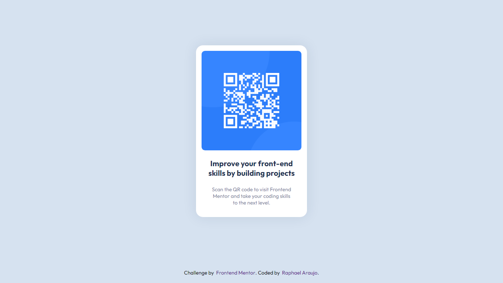

# Frontend Mentor - QR code component solution

This is a solution to the [QR code component challenge on Frontend Mentor](https://www.frontendmentor.io/challenges/qr-code-component-iux_sIO_H).

## Table of contents

- [Overview](#overview)
  - [Preview](#preview)
  - [Links](#links)
- [My process](#my-process)
  - [Built with](#built-with)
- [Author](#author)

## Overview

### Preview

### Links

- Solution URL: [Source Code](https://github.com/rwsaraujo/QR-code-component)
- Live Site URL: [Live Site](https://rwsaraujo.github.io/QR-code-component/)

## My process

### Built with

- HTML5
- SCSS

## Author

- Website - [Araujo WebDev](https://rwsaraujo.github.io/araujowebdev/)
- Frontend Mentor - [@rwsaraujo](https://www.frontendmentor.io/profile/rwsaraujo)
- Twitter - [@rwsaraujo](https://www.twitter.com/rwsaraujo)
